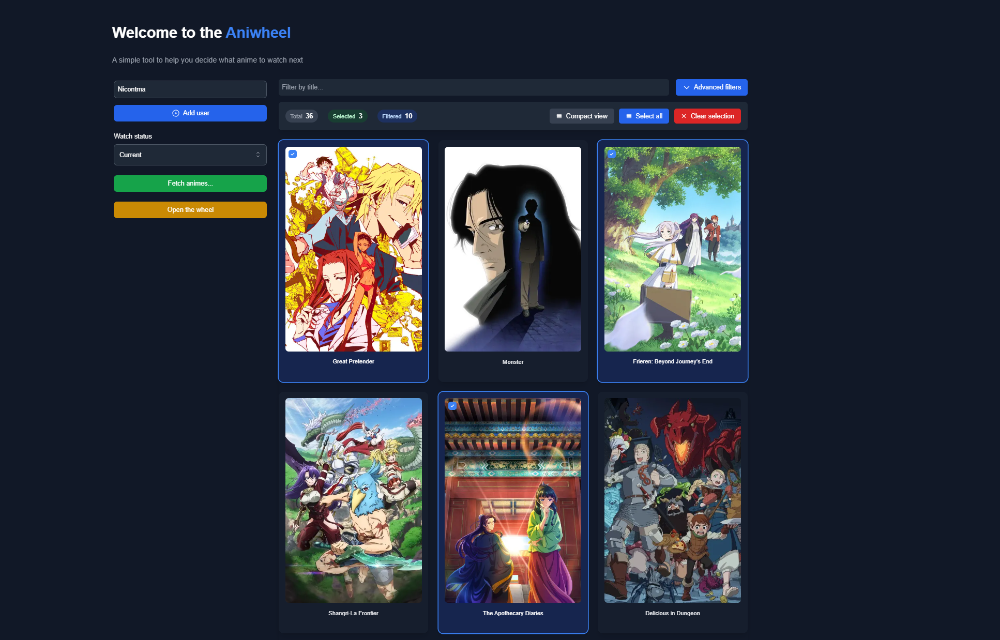

# 🎡 AniWheel

AniWheel is a fun and interactive tool that helps you and your friends decide what anime to watch next from your AniList watchlists. No more endless scrolling and indecision - let the wheel decide for you!

## ✨ Features

- 🎲 Randomly select an anime from your AniList Planning/Watching list
- 👥 Add multiple AniList users to find common shows h

## 🚀 Getting Started

1. Visit [AniWheel](https://aniwheel.com)
2. Enter your AniList username
3. Optionally add friends' usernames to find common shows
4. Spin the wheel and discover your next anime!

## 🤝 Contributing

Contributions are welcome! Feel free to submit issues and pull requests.

## 📝 License

This project is licensed under the AGPL-3.0 license - see the [LICENSE](LICENSE) file for details.

## 🙏 Acknowledgments

- [AniList](https://anilist.co) for providing the API
- [AnimeThemes.moe](https://animethemes.moe) for providing the opening themes
- All the contributors and users of AniWheel

---

Made with ❤️ for anime fans everywhere